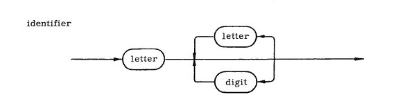

<!-- Ɛ -->
# GR - Gramática Regular (GLD)
<b>Nesta gramática a substituição é realizada da Esquerda -> Direita.</b>  
* É necessário montar a Gramática, Produção, Exemplos e Demonstração de funcionamento.  
  
<b>Lado negativo:</b> Não é possivel determinar abertura e fechamento de elementos.  
<b>Exemplo</b> ( ... ) { ... } [ ... ]
<hr>

### O que é gramática ?
Gramática = (Não Terminal, Terminal, Produção, Start)

<hr>

## a(ba)* = a, aba, ababa ...

### Gramática = ({S,X},{a,b},P,S)  

```json
P = {
    S -> aX
    X -> baX | Ɛ
}
```
:warning: Para todo elemento com fechamento **kleene**, ele será em loop em si mesmo, e caso esteja no final da expressão, terá o **epson** (Ɛ)
<hr>

## a(a+b) = aa, ab
### Gramática = ({S,X},{a,b},P,S)  
```json
P = {
    S -> aX
    X -> a | b
}
```
:warning: Quando não temos **kleene** ou **positivo**, não haverá repetição, consideramos apenas 1 iteração.

<hr>

## a(a+b)* = a, aa, ab, aaa, aab, aba, abb ...
### Gramática  = ({S,X},{a,b},P,S)
```json
P = {
    S -> aX
    X -> aX | bX | Ɛ
}
```

<hr>

## (a+b)* (cc)+ (b)+ = ccb, accb, bccb, aaccb, abccb ...
### Gramática = ({S,Y,Z},{a,b,c},P,S)

```json
P = {
    S -> aS | bS | Y
    Y -> ccY | ccZ
    Z -> b | bZ
}
```

* Tabela com algumas possibilidades de combinações  .
    |(a+b)*|(cc)+|(b)+|Resultado|
    |:--:|:--:|:--:|:--:|
    |Ɛ|cc|b|ccb|
    |a|cc|b|accb|
    |b|cc|b|bccb|
    |aa|cc|b|aaccb|
    |ab|cc|b|abccb|
    |ba|cc|b|baccb|
    |bb|cc|b|bbccb|
### Demonstração
```json
S     => S -> bS
bS    => S -> aS
baA   => S -> Y
baY   => Y -> ccZ
baccZ => Z -> b
// baccb
```
<hr>

# GLC - Gramática Livre de Contexto

<b>Nesta gramática a substituição é realizada pelo <- Centro -> </b>  

<b>Lado positivo:</b> É possivel determinar abertura e fechamento de elementos.  
<b>Exemplo</b> ( ... ) { ... } [ ... ]

<hr>

## | 2 + 1 | 2+(1-1) | (2+1)-1 | 2+(1-(1)) |
```json
S -> NON | NOC | CON
C -> (N) | (NON) | (NOC)
N -> 1 | 2
O -> + | -
```

### Demonstração
```json
S         => S -> NOC
NOC       => N -> 2
2OC       => O -> +
2+C       => C -> (NOC)
2+(NOC)   => N -> 1
2+(1OC)   => O -> -
2+(1-C)   => C -> (N)
2+(1-(N)) => N -> 1
// 2+(1-(1))
```
<hr>

# BNF - Backus Naur Form

Os símbolos não-terminais são delimitados pelos sinais <b> < > </b>  


|Notação|Símbolo|
|:--:|:--:|
|Produção|<b>: : =<b>|
|Não Terminal|<b>< ></b>|
|Alternativa|<b> \| </b>|
|Repetição| { ... }|

## Exemplo
```json
<letra> ::= a | b | c | ... | z
<palavra> ::= <letra><palavra> | <letra>
```
```json
<boolean> ::= true | false
```
```json
<integer> ::=  <numeric><numeric>
<numeric> ::= 0|1|2|3|4|5|6|7|8|9
```


<hr>

# EBNF Extended Backus Naur Form

|Notação|Símbolo|
|:--:|:--:|
|Prioridade| ( ... )|
|Opcional|[ ... ]|
|Terminal|' ... '|

## Exemplo
```json
<letra> ::= 'a' | 'b' | 'c' | ... | 'z'
```
```json
<number> ::= <numeric>{<numeric>}
<numeric> ::= 0|1|2|3|4|5|6|7|8|9
```
```json
<decimal> ::= <integer>'.'<integer>
<integer> ::= <numeric>{<numeric>}
<numeric> ::= 0|1|2|3|4|5|6|7|8|9
```

<hr>

# Compilador Java

## Compilador em formato T


Um compilador em formato T representa o funcionamento da estrutura de criação de um compilador. Para criarmos um compilador é necessário utilizar de uma linguagem de programação pré existente, no nosso caso utilizamos a linguagem java.
Ao modificarmos o arquivo .flex podemos gerar um analisador léxico Lexer.java que irá ler o programa de entrada e processar todos os elementos até um ponto de termino.


Podemos criar um compilador de Java utilizando Python, C, C# ... e propriamente Java.

## Bootstraping

Representa a arvore de compilação do compilador de último nível. Ou seja, demonstra graficamente em diagramas em T o funcionamento do compilador atual até o processo de conversão em linguagem de máquina. 
## BNF + Gráfico
**Colocar mais exemplos**


Diagramas BNF representam unicamente a linha a ser avaliada, exibindo gráficamente o que acontece com aquela linha em observação. Neste exemplo podemos criar nomes para um identificador, sendo composto por necessáriamente uma letra e podendo conter N outras letras ou N números em sequencia, até que o loop se encerre e o gráfico chege ao final.

## JFLEX
### Como converter uma expressão regular para BNF ?
Dada a expressão regular  : 
```java
(a+b)* (cc)+ (b)+
```
Envolva toda a expressão por parenteses, para que o resultado final seja considerado uma única string.

```java
( (a+b)* (cc)+ (b)+ )
```
Após, os elementos **+** (mais) que estiverem fazendo a função de OU, devem ser substituidos por **|** (pipe).

```java
( (a|b)* (cc)+ (b)+ )
```
Remove os parenteses dos elementos simples.
```java
( (a|b)* cc+ b+ )  { System.out.println(yytext()); }
```

### YYText e YYLength

Estas funções servem para indicar ao compilador a intenção de exibir no console quais as palavras que foram recebidas por ele (**yytext**) e o tamanho em caráctes que elas possuem (**yylength**). Vale resaltar que são funções em Java, precisam ser escritas dentro de um **{SOT(yytext());}**
### Anatomia do JFLEX

O bloco destacado em amarelo irá conter apenas código em java, e todo o texto escrito dentro deste container, será replicado ao arquivo java do compilador.

O bloco destacado em verde representa o local onde podemos definir regras e macros.

O bloco azul contêm as regras léxicas, onde são escritos as definições das palavras e os identificadores EBNF e suas consequências.
### Caracteres invisíveis
Carácteres invisíveis são recursos utilizados pelo computador para identificar espaços, quebras de linhas e término dos arquivos.
Para que o código do compilador reconheça estes elementos é importante utilizar-mos em sua composição.

|Notação|Função|
|:-:|:-:|
|\t|Tabulação|
|\ |Espaços|
|\r\n|Final da linha + Quebra|

### EBNF 
|Notação|Função|
|:-:|:-:|
|.|Qualquer carácter|
|[a-z]|qualquer letra de A a Z|
|a*|nenhum ou N sequencias de letras A|
|a+|uma ou N sequencias de letras A|
|a{2}|Exatamente 2 caracteres AA|
|a \| b|A ou B|
### Detecção do final do arquivo

Afim de detectar o final de um arquivo, é necessário que no código LEX seja implementado endpoints como: 

**\<\<EOF>> {SOT("NOT END FOUND"); return null;}**

Esta função tem como premissa retornar uma exception quando o fim do arquivo não foi encontrado. Porém é necessário implementar uma função que reconheça o final do arquivo, para que o programa apenas atinja este endpoint quando realmente houver um erro válido.
Para isso devemos declarar antes dessa função:

**FIM { SOT("O FIM CHEGOU !"); return null;}**

devemos sempre colocar um **return null** no final do código em java para que o compilador pare o reconhecimento das palavras e encerre sua execução. O mesmo vale para o primeiro exemplo acima.
